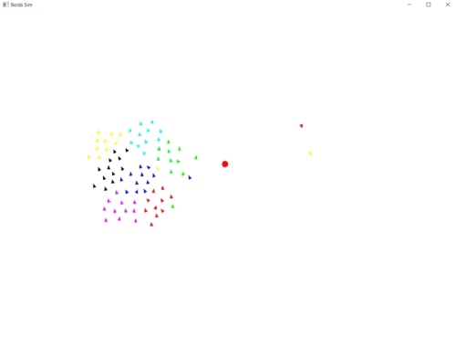

# Boids Simulation in the Rust Programming Language


## Description

This repository contains an implementation for the [Boids algorithm](https://en.wikipedia.org/wiki/Boids) - An algorithm
designed to simulate (roughly) the flight and flocking patterns of birds.

This project uses the Rust Programming Language and the very, very comfortable and reliable crate "ggez" for the GUI.

## Examples from Project

A simple video of the simulation with a small number of boids (80) circling a target:




800 boids starting with wall evasion and then spreading out when it is turned off:


800 boids flying without limitation and then changing direction when a target is selected:


80 boids flying with wall evasion and one is chosen as leader:


---

## Project Features

The project doesn't only simulate boids but also allows you to toggle some additional rules. The features for the users
are:
* **Toggle Wall Evasion** - By default the boids are instructed to get away from the walls of the screen.<br>
The user can turn off this instruction by pressing the *W* key on their keyboard. When wall evasion is off, boids will
not try to avoid walls and when going past the screen's dimensions will warp around the opposite side.<br>
To re-toggle wall evasion, press *W* again.

* **Set Boid Target** - The user can pick a location on the screen that will be declared as a target for the boids.
All boids of every color will try to arrive at that point, which sometimes create the beautiful pattern of boids
circling the target.<br>
To pick a new target simply click on the new location. To delete the target and resume normal boid behaviour, press the
*space* key on the keyboard.

* **Toggle Leader Behaviour** - If the user presses the *L* key, the simulation will choose a boid to be the "leader" of
the boids - all boids will try to get to its location. The leader will be marked by a yellow circle around it. To turn
this behaviour off, the user should press the *L* key again.

## Basic Algorithm Overview

In order to clarify those new to the algorithm, a "*boid*" is just an object with a position and velocity (and color, in
our case) whose goal is to simulate a bird.<br>

### Normal Algorithm
The basic algorithm for boids is quite simple. At every time-step, each boid's velocity is determined by three rules, 
each producing one velocity vector:
1. **Separation** - When nearby boids are too close to the current boid (i.e: Once they pass a certain distance limit),
move away from them.<br> The velocity vector of this rule is calculated by calculating the difference vectors between
the current boid and the boids around it, summing them up and negating them.
2. **Alignment** - Nearby boids affect the direction of the current boid. The current boid's velocity should match the
average velocity of the boids around it.<br> The velocity vector of this rule can be calculated by calculating the 
average velocity vector of nearby boids (boids within a certain radius), and subtracting it from the current boid's 
velocity.
3. **Cohesion** - The current boid should be within a flock, therefor it should go towards to center of mass of the 
flock. This pulls boids enough to form flocks (and often this rule and the *Separation* rule fight for dominance).<br>
The velocity vector of this rule can be calculated by calculating the average position of nearby boids, and subtracting
that vector from the current boid's position.

After all velocity vectors are calculated, each velocity vector is multiplied by a certain factor (the factor is unique
for each rule), and they are summed up and added to the current boid's velocity.

This is the general boids algorithm with no further customization.

### Tweaks to the Algorithm
In this simulation, a few tweaks were added to the algorithm.

First of all, all features mentioned in the *Project Features* section are rules that were added on top of the previous
three rules.

Second of all, the alignment and cohesion rules were changed a bit. Instead of considering **all** nearby boids for
these rules' velocity vectors calculations, only nearby boids **with the same color as the current boid** are used in
the calculations. This is a nice tweak in my opinion, as it makes boids with similar colors form flocks which gives them
a more consistent feeling rather than poly-color flocks.<br>Pay attention that the separation rule is not affected as
differently colored boids will still try not to bump into each other.


## Installation

### Prerequisites
Since this is a Rust project, you will obviously need [Rust](https://www.rust-lang.org/tools/install) installed on your
computer. All other dependencies are specified in the `Cargo.toml` file, and rust will handle them.

### Clone Repository
After ensuring Rust is installed on your computer and working properly, clone the repository to your local machine:

```shell
git clone https://github.com/Yair5675/boids.git
cd boids
```

### Build Project
Once you've successfully cloned the repository and navigated to it using the commandline, build the project in one of
the following ways:

#### Debug Mode
```shell
cargo build
```
When building in debug mode the executable will run slower than release mode but will be built faster.

#### Release Mode (Recommended)
```shell
cargo build --release
```
When building in release mode the executable will be as optimized as possible and will run much faster than debug mode,
albeit the executable will take more time to be built for the first time.

### Running the Project
Once the build is complete, run it in either debug or release mode by either going to the target folder, choosing the
built mode's folder and running the executable, or running the following commands in the root directory:

#### Debug Mode
```shell
cargo run
```

#### Release Mode (Recommended)
```shell
cargo run --release
```


## Customization

For anyone who wishes to tweak more values, I present: `constants.rs`. This file is located at the `boids/src` 
directory and, as you might've imagined, holds the constants of the simulation.

It is my advice not to change anything related to the boids' rules parameters as they are very delicate and (in my 
opinion) are already set to a good value, but you can if you insist.

Obviously parameters such as `SCREEN_WIDTH`, `SCREEN_HEIGHT` and `FPS` can be changed without thought.

Here is a list of all parameters in the file, who should and who should not be tempered with, their default values and
special notes if you wish to change them:


| Parameter Name             | Parameter Type  | Allowed to Change | Default Value                                                                                            | Special Notes                                                                                                                                                                                                                                                                                                                                                                                                            |
|----------------------------|-----------------|-------------------|----------------------------------------------------------------------------------------------------------|--------------------------------------------------------------------------------------------------------------------------------------------------------------------------------------------------------------------------------------------------------------------------------------------------------------------------------------------------------------------------------------------------------------------------| 
| PROGRAM_NAME               | &str            | No                | Boids Sim                                                                                                | You could technically change this without the program crashing but this is the original program's name so please don't                                                                                                                                                                                                                                                                                                   |
| AUTHOR                     | &str            | No                | Yair Ziv                                                                                                 | Same as `PROGRAM_NAME`                                                                                                                                                                                                                                                                                                                                                                                                   |
| SCREEN_WIDTH               | f32             | Yes               | 1400.0                                                                                                   |                                                                                                                                                                                                                                                                                                                                                                                                                          |
| SCREEN_HEIGHT              | f32             | Yes               | 1000.0                                                                                                   |                                                                                                                                                                                                                                                                                                                                                                                                                          |    
| BOIDS_NUM                  | usize           | Yes               | 800                                                                                                      | A higher value could potentially mean slower execution (800 is already a lot but works good)                                                                                                                                                                                                                                                                                                                             |
| MAX_BOID_VELOCITY          | f32             | Yes               | 6.0                                                                                                      | Must be positive and greater than or equal to `MIN_BOID_VELOCITY`                                                                                                                                                                                                                                                                                                                                                        |
| MIN_BOID_VELOCITY          | f32             | Yes               | 5.0                                                                                                      | Must be positive and less than or equal to `MAX_BOID_VELOCITY`                                                                                                                                                                                                                                                                                                                                                           |
| BOID_COLORS                | Array of Colors | Yes, BUT          | ```[Color::BLACK, Color::YELLOW, Color::BLUE, Color::MAGENTA, Color::GREEN, Color::RED, Color::CYAN ]``` | You have to be careful when changing this parameter. All colors added need to be created using [ggez's Color type](https://docs.rs/ggez/latest/ggez/graphics/struct.Color.html), and when changing the amount of colors in the array the new number of colors must be specified in the variable's type declaration (see [Array Creation in Rust](https://doc.rust-lang.org/book/ch03-02-data-types.html#the-array-type)) |
| SEPARATION_FACTOR          | f32             | Yes               | 0.1                                                                                                      |                                                                                                                                                                                                                                                                                                                                                                                                                          |
| ALIGNMENT_FACTOR           | f32             | Yes               | 0.05                                                                                                     |                                                                                                                                                                                                                                                                                                                                                                                                                          |
| COHESION_FACTOR            | f32             | Yes               | 0.005                                                                                                    |                                                                                                                                                                                                                                                                                                                                                                                                                          |
| EVASION_FACTOR             | f32             | Yes               | 1.3                                                                                                      |
| TARGET_FACTOR              | f32             | Yes               | 0.0005                                                                                                   |
| LEADER_FACTOR              | f32             | Yes               | 0.0005                                                                                                   |
| MARGIN                     | f32             | Yes, BUT          | `SCREEN_WIDTH` / 10.0                                                                                    | A boid starts feeling the evasion rule when it is at most `MARGIN` distance away from the screen's borders. This value can be changed, but I highly encourage you to only change the denominator in the expression, in order to keep `MARGIN` proportional to `SCREEN_WIDTH`                                                                                                                                             |
| STEERING_DISTANCE          | f32             | Yes               | 25.0                                                                                                     | This is the distance mentioned in the **Separation** rule, and should be less than `INFLUENCE_DISTANCE`                                                                                                                                                                                                                                                                                                                  |
| STEERING_DISTANCE_SQUARED  | f32             | No                | `STEERING_DISTANCE` * `STEERING_DISTANCE`                                                                |
| INFLUENCE_DISTANCE         | f32             | Yes               | 75.0                                                                                                     | This is the distance mentioned in the **Alignment** and **Cohesion** rules, and should be more then `STEERING_DISTANCE`                                                                                                                                                                                                                                                                                                  |
| INFLUENCE_DISTANCE_SQUARED | f32             | No                | `INFLUENCE_DISTANCE` * `INFLUENCE_DISTANCE`                                                              |
| LOCATION_GRID_HEIGHT       | usize           | No                | `(SCREEN_HEIGHT / INFLUENCE_DISTANCE) as usize + 1`                                                      | Constant used for optimization operations in the program, don't touch if you don't want the program to crash/act unexpectedly                                                                                                                                                                                                                                                                                            |
| LOCATION_GRID_WIDTH        | usize           | No                | `(SCREEN_WIDTH / INFLUENCE_DISTANCE) as usize + 1`                                                       | Same as `LOCATION_GRID_HEIGHT`                                                                                                                                                                                                                                                                                                                                                                                           |
